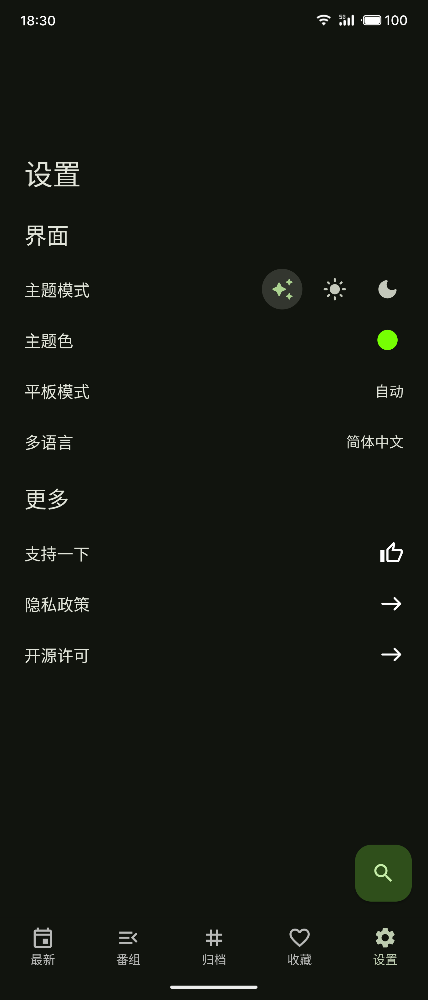
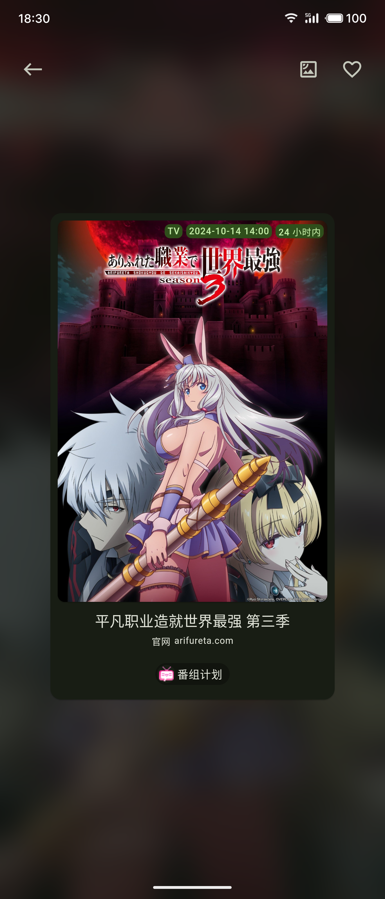
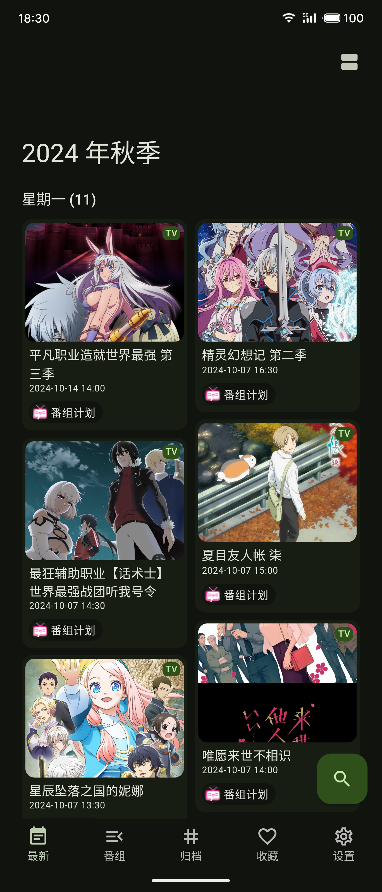
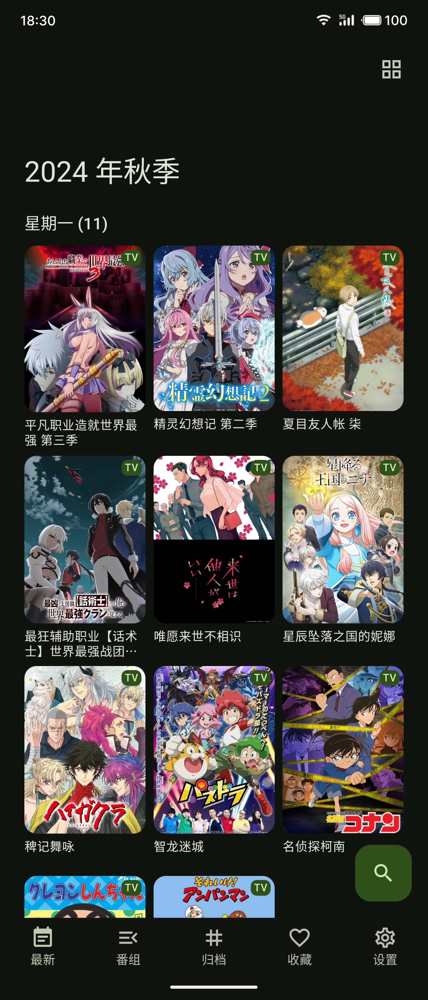
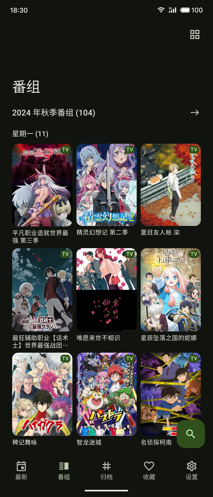
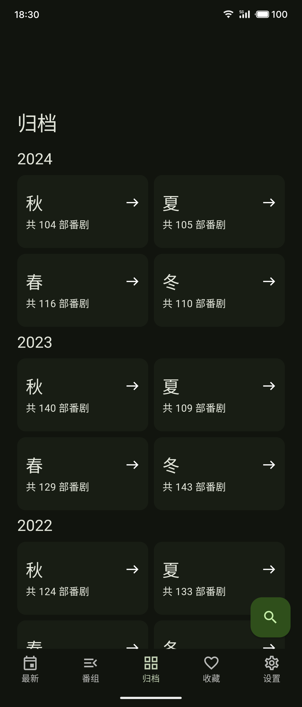
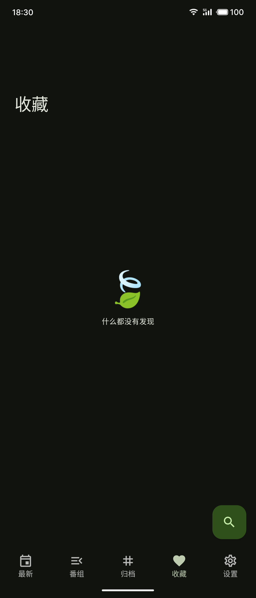

<p align="center">

</p>

# BangumiD

`BangumiD` is a simple anime search application with data sourced
from [bangumi-data](https://github.com/bangumi-data/bangumi-data). This project is designed to serve as a reference for
learning Flutter, helping beginners better understand how to use Flutter.


## Stars

[](https://stars.medv.io/iota9star/bgmd)

**If this project has been helpful to you, feel free to give it a `Star` for support. Thank you!**

### Screenshots

<table>
<tbody>
<tr>
<td></td>
<td></td>
<td></td>
</tr>
</tbody>
</table>
<table>
<tbody>
<tr>
<td></td>
<td></td>
<td></td>
<td></td>
</tr>
</tbody>
</table>

## Licenses

This project is licensed under the `Apache License 2.0` and is intended for learning and educational purposes only.
Please delete it within 24 hours of downloading, and ensure that its use complies with local laws and regulations. Do
not use it for any illegal activities.

``` text
Copyright 2024. iota9star

Licensed under the Apache License, Version 2.0 (the "License");
you may not use this file except in compliance with the License.
You may obtain a copy of the License at

    https://www.apache.org/licenses/LICENSE-2.0

Unless required by applicable law or agreed to in writing, software
distributed under the License is distributed on an "AS IS" BASIS,
WITHOUT WARRANTIES OR CONDITIONS OF ANY KIND, either express or implied.
See the License for the specific language governing permissions and
limitations under the License.
```